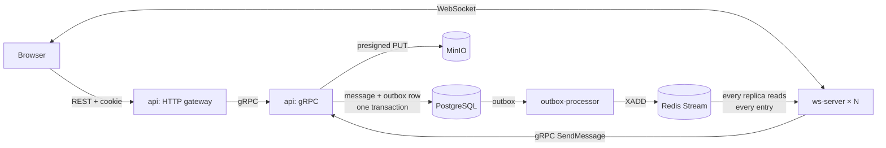

# Awesome Chat — Backend

> Real-time chat backend in Go: a gRPC API with an HTTP gateway generated from one contract, a stateless WebSocket tier that writes through the API, a Transactional Outbox relayed to Redis Streams, and a fan-out that delivers every message to every WebSocket replica.


Part of the **Awesome Chat** ecosystem: **Backend** · [Proto contracts](https://github.com/D1sordxr/awesome-chat-proto) · [Frontend](https://github.com/D1sordxr/awesome-chat-frontend) · Deploy (`awesome-chat-deploy`)

## Architecture



1. A client sends a message over its WebSocket. `ws-server` holds no business logic: it calls `api` over gRPC, the same `SendMessage` the HTTP gateway exposes.
2. `api` validates the call, checks membership and writes the message together with an outbox row in one transaction. There is no dual write: the message is stored if and only if its event is.
3. `outbox-processor` relays outbox rows to a Redis Stream.
4. Every `ws-server` replica reads the whole stream and pushes each message to the members connected to it. A message that arrived at replica A reaches a client on replica B, so the Ingress needs no sticky sessions.

The contract lives in [awesome-chat-proto](https://github.com/D1sordxr/awesome-chat-proto): `.proto` files with `google.api.http` annotations, generated with buf. The same source produces the gRPC server here, the REST surface through grpc-gateway and, later, the TypeScript client.

## Design decisions

- **One contract, two transports.** `api` serves gRPC; the gateway is a separate HTTP server that dials it. Browsers use REST with an httpOnly cookie, which the gateway turns into `authorization` metadata; `Login` and `Logout` set and clear the cookie.
- **Identity comes only from the token.** No write request carries a `user_id`.
- **Idempotent sends.** `SendMessage` requires a client-generated `idempotency_key`, so that a retry cannot create a duplicate.
- **Voice without proxying bytes.** `CreateVoiceUpload` returns a presigned URL and an object key; the browser uploads to MinIO directly and `SendVoiceMessage` passes the key.
- **Fan-out, not load balancing.** The stream is read by every replica, not shared through one consumer group that would split messages between them.
- **Cursor pagination** by `message_id`; no offsets.
- **Errors as gRPC statuses.** Domain errors map to codes in one interceptor; validation failures carry `BadRequest` field violations, which the gateway renders as JSON.
- **Request correlation.** The gateway accepts or generates `X-Request-Id`, passes it to gRPC metadata and returns it; the HTTP and gRPC log lines of one request share the id.

## Status

The architecture above is the target of stage 3 of the roadmap. Where the code stands:

| Part | State |
|---|---|
| `api`: gRPC services, gateway, cookie auth, error mapping, request logging | done |
| Schema rewrite (migration 3), outbox table written in the message transaction | done |
| Configuration from environment only, one Dockerfile for all binaries | done |
| Shared infrastructure moved to [`D1sordxr/packages`](https://github.com/D1sordxr/packages) | in progress: logging done; gRPC server, interceptors, app runner, Postgres and Redis next |
| `outbox-processor` publishing to Redis Streams instead of Kafka | to do |
| `ws-server` as a gRPC client of `api`, reading the stream for fan-out | to do: still trusts the user id in the path and publishes to the stream itself |
| Removing Kafka: `topic-creator`, the Kafka producer and consumer | to do |
| `worker` (batched persistence from the stream) | to be removed: persistence moves into `api` |
| Deduplication by `idempotency_key`: the contract requires the key, the server does not use it yet | to do |
| Outbox throughput: LISTEN/NOTIFY wake-up, drain until empty, bigger batches | to do |

## Services

| Binary | Responsibility |
|---|---|
| `cmd/api` | gRPC server and the HTTP gateway in front of it |
| `cmd/ws-server` | WebSocket connections: client registry and delivery to local clients |
| `cmd/outbox-processor` | Outbox relay |
| `cmd/migrate` | goose migrations, run as a Job before the services |
| `cmd/broadcaster` | Load generator: a WebSocket client that floods a chat |
| `cmd/worker`, `cmd/topic-creator` | Legacy, removed with the Kafka path |

## Running

There is no docker-compose. PostgreSQL, Redis and MinIO run in the local k3d cluster from `awesome-chat-deploy`, with passwords from Vault.

```bash
make run             # api with local.env: HTTP gateway :8080, gRPC :9090
make run-ws-server   # ws-server on :8081
make images          # one image per binary from the shared Dockerfile
make check           # build, vet, race tests, golangci-lint
```

Configuration is read from environment variables only; `local.env` holds the local values. In the cluster the same variables come from a ConfigMap and from a Secret synced from Vault by External Secrets Operator.

Images are built `FROM scratch` and run as uid 65532: debug with `kubectl debug`, not a shell.

## REST surface

| Method | Path | RPC |
|---|---|---|
| `POST` | `/v1/auth/register` | `UserService.Register` |
| `POST` | `/v1/auth/login` | `UserService.Login` — sets the auth cookie |
| `POST` | `/v1/auth/logout` | `UserService.Logout` — clears it |
| `GET` | `/v1/auth/me` | `UserService.GetCurrentUser` |
| `GET` | `/v1/users` | `UserService.ListUsers` |
| `POST` | `/v1/chats` | `ChatService.CreateChat` |
| `GET` | `/v1/chats` | `ChatService.ListChatPreviews` |
| `POST` | `/v1/chats/{chat_id}/members` | `ChatService.AddMember` |
| `POST` | `/v1/chats/{chat_id}/messages` | `MessageService.SendMessage` |
| `GET` | `/v1/chats/{chat_id}/messages` | `MessageService.ListMessages` |
| `POST` | `/v1/chats/{chat_id}/voice-uploads` | `MessageService.CreateVoiceUpload` |
| `POST` | `/v1/chats/{chat_id}/voice-messages` | `MessageService.SendVoiceMessage` |

`UserService.ListUserChatIds` has no HTTP mapping: it is an internal call from `ws-server`.

## Project layout

```
cmd/                   # one composition root per binary
internal/
  domain/              # entities, value objects, domain errors
  application/         # use cases: user, chat, message, outbox
  infrastructure/      # postgres, redis, minio, jwt, ws hub, audio, config
  transport/
    grpc/              # handlers, interceptors, error mapping
    gateway/           # grpc-gateway HTTP server: cookie auth, CORS, request logging
    httpgin/           # ws-server HTTP surface
    worker/            # background loops
migrations/            # goose SQL migrations
```

## Tech

Go 1.27 · gRPC · grpc-gateway · buf · protovalidate · gorilla/websocket · pgx v5 · go-redis v9 · MinIO · goose · log/slog · [D1sordxr/packages](https://github.com/D1sordxr/packages) · k3d · Vault · External Secrets Operator
